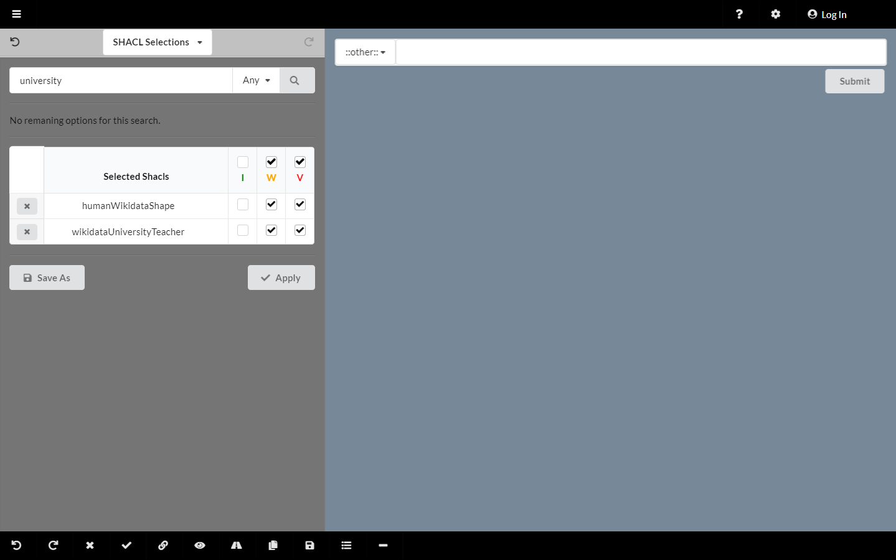
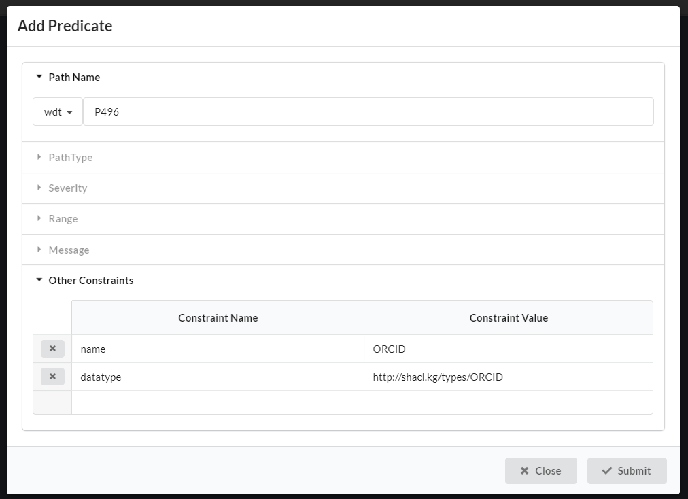
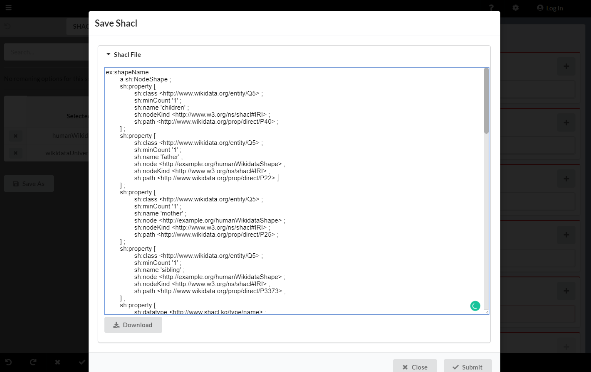

# Schímatos
A SHACL-based Web-Form Generator for Knowledge Graph Editing

Knowledge graph creation and maintenance is typically inaccessible to naïve users.
One barrier is the paucity of user-friendly publishing tools that separate schema modeling from the data creation.

The *Shapes Constraint Language* (SHACL) is a W3C standard for validating RDF-based knowledge graphs against a set of conditions provided as shapes.
This enables structure, i.e. domain-relevant patterns, to be enforced on data graphs built against pre-defined shapes.  

**Schímatos** is a form-based Web application with which users can create and edit data against such shapes graphs.
Forms are generated from and stored as shapes graphs.
These graphs may either be handcrafted within the tool (using a form building GUI), assembled by aggregating existing shapes graphs (also available as a GUI), or automatically generated with machine learning techniques.

During data-entry, the tool uses entity relationships and attribute requirements to generate a Web-form for end-users.  Attribute constraints are then used to perform client-side validation.  Thus, this tool enables end-users to create and edit complex data graphs abstracted in an easy-to-use GUI. 
 Additionally, validation procedures reduce the introduction of erroneous data.

## Demo
The demo is currently running at [schimatos.github.io](http://schimatos.github.io). The downloadable [distribution](https://github.com/schimatos/schimatos.org/tree/master/dist) is also preconfigured for the demo; it can be run by downloading the distribution and then opening the [index.html](https://github.com/schimatos/schimatos.org/tree/master/dist/index.html).

### Data entry
To perform data entry on the entity open the sidebar and use the dropdown in the sidebar header to navigate to `Target Selections`. In this demo, the entity of interest is *Sergio José Rodríguez Méndez* and so can be found by searching for 'Sergio'. In the dropdown, select `wd:Q88056610`, this is the identifier for *Sergio José Rodríguez Méndez*. Once selected, you will see that the value has been automatically entered as the focus of the form. Details about the entity are provided in the sidebar. This can be used to confirm that one is working with the correct entity.

Now use the dropdown in the sidebar header to navigate to `SHACL Selections` and search for the 'wikidataHumanShapeDemo'; as the label is "Wikidata human shape demo" simply searching for 'human' will return it as a result. Select the shape and click the `Apply` button to generate the form.

Any values that are already submitted will be prefilled into the form. Note that since multiple users can access the demo; this may either be empty, partially or fully complete depending on what others have submitted. If this is the case you can remove these entries from the database by selecting the `x` next to the entry. To create more fields in any section click the `+` button at the top right of the section. To ensure that values are validated and ready for submission, press `ENTER` after completing a field.

To submit entries, click the `Submit` button at the bottom of the form. This will submit all entries that have passed validation.

### SHACL Creation

Open the SHACL selection panel and search 'human' and select the `humanWikidataShape`. Repeat this process with 'university' an and select the shape `wikidataUniversityTeacher`. You should see a screen similar to  Select apply to create a form with the merged SHACL constraints. To add the ORCID property, select the add new property path button  Then fill out the settings as shown  to give it a name and datatype. Press submit to add it to the form. Click the save button at the bottom of the screen to see a screen like  From here you can download the shape and add additional annotation such as an `rdfs:label` and correct naming. The SHACL can then be uploaded to the SHACL store as shown 

## License
Content submitted to [schimatos.org](http://schimatos.org/) is MIT licensed, as found in the [LICENSE.md](https://github.com/schimatos/schimatos.org/blob/master/LICENSE) file.
